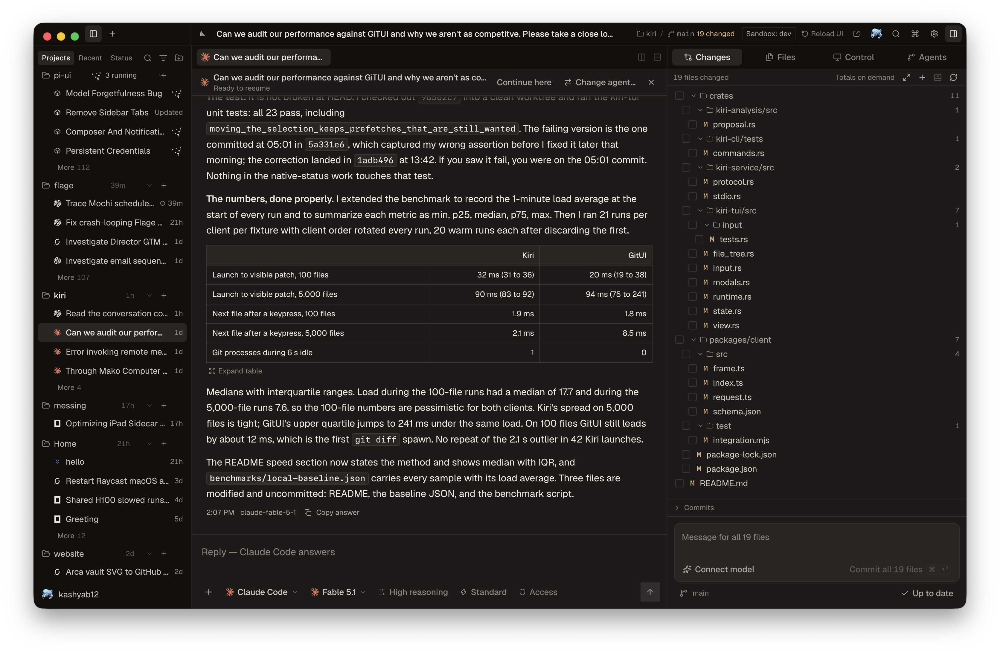
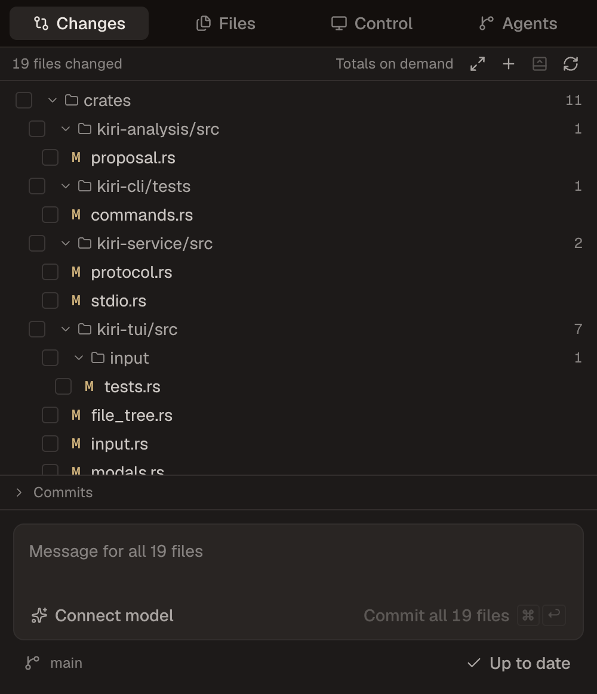
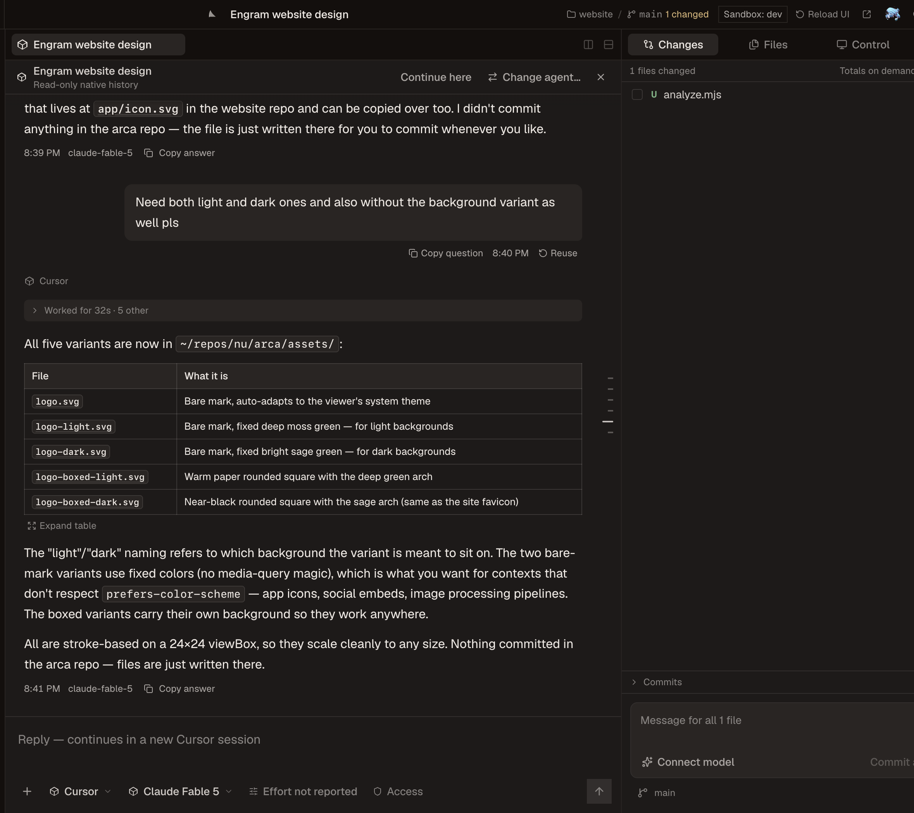

<p align="center">
  
</p>

<h1 align="center">Mako</h1>

<p align="center">
  One desktop app for Claude Code, Codex, Cursor, Grok, Devin, and OpenCode.
</p>

<p align="center">
  <a href="https://github.com/Verbiflow/mako/releases"></a>
  
  <a href="LICENSE"></a>
  <a href="https://github.com/Verbiflow/mako/actions/workflows/release.yml"></a>
</p>

> **Alpha.** Mako is under active daily development. Expect breaking changes
> between releases, features that move or disappear, and rough edges. If
> something breaks or confuses you, please
> [open an issue](https://github.com/Verbiflow/mako/issues); every report is
> read and helps decide what gets fixed next.

<p align="center">
  
</p>

Mako is a macOS workspace for AI coding agents. It finds the sessions your
agent CLIs already created, opens them live, and lets you resume each one with
the tool that made it or hand it to a different agent. Several agents run at
once, each in its own thread, beside the git diff and the files they touch.
Every agent you launch from Mako can also drive your browser and your Mac.

If you keep six terminal tabs open for six different agents, this is the one
window that replaces them.

## What it does

- Runs every supported agent side by side. Each thread keeps its own provider,
  model, reasoning effort, and access tier.
- Lists sessions from Mako, your terminal, and any ACP client such as Zed,
  grouped by project and ordered by activity. The list keeps syncing in the
  background, so a cold start reads a warm cache instead of scanning disk.
- Streams text, reasoning, tool calls, plans, permission prompts, and subagent
  work as they happen. An Agents surface shows the subagents a provider spawns.
- Resumes a session through its original tool, or continues it with a
  different agent.
- Gives every launched agent browser and computer control on your machine.
  A Control surface shows what the agent last observed.
- Lets an agent delegate a bounded subtask to a different provider. The child
  works in an isolated copy of the workspace and its result returns to the
  parent conversation.
- Shows the working tree next to the conversation: changed files, diffs,
  history, a commit-message drafter with Fast and Deep modes, and push.
- Turns every prompt into a rewind point. Rewinding restores the files as they
  were, from snapshots that never touch your repository's object database.
- Opens files in tabs beside the chat, with split panes and a terminal dock
  whose shells survive window closes and app restarts.
- Lists the selected agent's skills and MCP servers when you type `/` or `$`.
- Keeps a Usage page with spend by day, source, and model.
- Runs saved prompts as automations from a committable file in the project,
  triggered by hand, file changes, commits, Slack, mail, calendar events, or a
  webhook. Every automation arrives switched off on a new machine.
- Extends itself. Single-file UI extensions hot-load from your data directory
  and can add commands, panels, and slots without a reload.

<table>
  <tr>
    <td width="62%"></td>
    <td width="38%"></td>
  </tr>
</table>

## Sessions from other tools

<p align="center">
  
</p>

Mako reads each tool's own session store. Credentials stay with the tool that
owns them, and the interface only ever sees a redacted, provider-neutral view.

| Provider | Discover | Follow live | Resume | Transport |
| --- | :---: | :---: | :---: | --- |
| Claude Code | yes | yes | yes | Agent SDK |
| Codex | yes | yes | yes | app-server |
| Cursor | yes | yes | CLI sessions | ACP |
| Grok | yes | yes | yes | ACP |
| Devin | yes | yes | yes | ACP |
| OpenCode | yes | yes | yes | ACP |

Cursor CLI sessions resume through `cursor-agent`. Cursor Desktop chats open
read-only and continue by copying the conversation into a new session.

Continuing a thread with a different agent writes a native session into that
agent's own store for Claude Code, Codex, Cursor, and Grok, so its ordinary
resume loads the full history. Devin and OpenCode receive the conversation as
a transcript file that the new session reads first.

Completed tool calls fold into a work log under the answer they produced.
A running turn stays open with live activity. An interrupted turn is marked
interrupted, not presented as finished work.

Access tiers are one ladder across providers: plan, chat, ask, edits, auto,
and full. The picker shows each provider's own name beside the tier, and Mako
never offers a tier nobody enforces. While a turn runs, Enter steers it on
providers that support steering and Cmd+Enter queues the message.

## Browser and computer control

Mako attaches its own tools to every session it launches, for every provider,
without editing that provider's MCP configuration. Everything runs on your
Mac over loopback connections.

**Browser.** The Mako Browser extension for Chrome, Edge, Brave, and Chromium
talks to Mako over native messaging, so no remote-debugging port is ever
opened. Agents open and observe tabs, click, type, press keys, scroll, upload,
handle dialogs, download files, print to PDF, read cookies without values
unless asked, and run scripted sequences. Settings > MCP > Browser access
prepares the extension folder; you load it unpacked and connect each profile.
Mako also exposes itself as a browser target, so an agent can inspect or
screenshot the desk in a hidden window without touching the one you are in.

**Computer.** Native applications are driven through the CUA driver, an
external install at `/Applications/CuaDriver.app` or on your `PATH`. It runs
under Mako's identity, so macOS Accessibility and Screen Recording are granted
to Mako once, from Settings > MCP. Agents list apps and windows, read
accessibility trees, click and type into a window in the background without
taking your pointer, drive menus, and manage the clipboard. Settings shows the
driver version Mako was verified against and offers the driver's own update.

**Integrations.** Settings > Integrations lists what each agent can reach:
local capabilities such as Browser Use, Computer use, Apple Mail, and Apple
Messages; Google Workspace through your signed-in local browser; GitHub
through the GitHub CLI; Linear, Notion, Sentry, Atlassian, and Microsoft Teams
through their own sign-in; and Slack through the optional Mako backend.

## Slack and remote work

With the optional backend paired, you can send work to your Mac from Slack.
The backend verifies Slack's timestamped signatures against a team and user
allowlist, queues requests while the Mac is offline, and runs them when it is
back. It never runs a model. You can deploy it yourself; see
[Run your own Mako Slack bot](docs/self-hosted-slack.md). Browser and computer
control never go through the backend.

## Install

Mako ships for Apple-silicon Macs and is **not signed or notarized by Apple**.
Read the [installer](scripts/install-macos.sh) first, then run:

```bash
curl -fsSL https://github.com/Verbiflow/mako/releases/latest/download/install-macos.sh | bash
```

The script downloads the DMG and its published checksum, verifies the DMG
before mounting it, copies only Mako into Applications, and removes quarantine
from that one app. It does not change Gatekeeper or any other macOS policy.
Unsigned builds cannot verify automatic updates, so re-run the same command to
update. See [macOS distribution](docs/macos-release.md) for the full
disclosure and manual DMG steps.

Browser control needs the extension loaded once per Chrome profile. Computer
control needs the CUA driver installed and two macOS permissions granted to
Mako. Both are optional; agents work without them.

### Run from source

Requires Node.js 24, Git, and at least one supported agent CLI.

```bash
git clone https://github.com/Verbiflow/mako.git
cd mako
npm install
npm run desktop
```

`npm run dev` serves the same interface in a browser against your real
sessions. Reload UI picks up renderer edits without restarting agents, and
`npm run dev:hot` makes that automatic. A source checkout keeps its own data
directory and its own host, so it runs beside the installed app. Opening a
thread never starts an agent. Sending a prompt does.

A source checkout can also produce a locally signed build with
`npm run update:local`, which builds, waits for running agents to finish,
installs, and reopens Mako. Locally signed installs can rebuild and reinstall
themselves from Settings > Updates.

## Keyboard

| Keys | Action |
| --- | --- |
| `⌘K` | Command palette |
| `⌘N` | New session |
| `⌘T` / `⌘W` | Attach another session / close the active tab |
| `⌘⇧[` / `⌘⇧]` | Previous / next attached session |
| `⌘L` | Focus the composer |
| `⌘⎋` | Stop the current turn |
| `⌘O` | Open folder |
| `⌘P` | Open a file |
| `⌘⇧E` | Show the project files |
| `⌘⇧F` | Search files and conversations |
| `⌘⇧L` | Search sessions |
| `⌘⇧G` | Draft a commit message |
| `⌘⇧D` | Toggle the diff pane |
| `⌘⇧M` | Switch model |
| `⌘.` | Cycle reasoning effort |
| `⌘J` | Terminal dock |
| `⌘B` / `⌘⌥B` | Session list / right sidebar |
| `⌘1`, `⌘2` … | Chat, then each right-sidebar surface in order |
| `⌘R` | Reload the interface without stopping agents |
| `⌘,` | Settings |
| `⌘/` | What is where |

Every shortcut can be rebound in Settings > Keyboard shortcuts.

## How it is built

```text
Claude Code · Codex · Cursor · Grok · Devin · OpenCode
                        │
                        ▼
        Electron host + @mako/sessions + Kiri
   provider processes · session stores · git · control tools
                        │
                        ▼
                 React renderer
```

The host owns provider processes, native session formats, credentials, and
Git. Git itself runs through Kiri, a sidecar engine shipped with the app. The
renderer speaks one wire contract. Streaming sends only the message in flight,
long lists are virtualized, and unchanged sessions are never reread. Every
provider is installed from one module and no provider gets a privileged path.

Two small processes outlive the host on purpose: a terminal daemon that keeps
your shells alive, and a session sync daemon that watches provider stores.
Both are replaced automatically by the build that starts them. Session sync
runs inside the app by default; "keep syncing when closed" in Settings >
Agents turns it into a user-level login item. [AGENTS.md](AGENTS.md) has the
full set of rules.

## Security

- Provider credentials stay in provider storage or the macOS Keychain. Keys
  for commit drafting are encrypted with Electron's safeStorage.
- The host strips secrets before anything reaches the interface. MCP server
  listings are redacted, and secret values never cross IPC or logs.
- Browser and computer control run on your machine over loopback. There is
  no cloud browser mode. The extension talks only to Mako, and the driver
  acts under Mako's own macOS permissions.
- The Mako backend is optional and inert until you pair it. It carries Slack
  and connector traffic, never browser or computer control, and you can run
  your own.
- UI extensions are trusted local code. They run inside Mako's renderer with
  full access to its state, so only load files you wrote or read.
- Crash reports stay on disk until you choose to copy one.

## Development

```bash
npm run lint
npm run typecheck:all
npm test --workspace @mako/sessions
```

Read [AGENTS.md](AGENTS.md) before touching provider or host code.

## License

Mako is source-available under the [Elastic License 2.0](LICENSE),
© 2026 Verbiflow. Use it, modify it, fork it, and run it for yourself or
your company at any size, free, including the optional backend for your own
team. The license forbids one thing: offering Mako itself to third parties
as a hosted or managed service. Versions up to v0.1.37 were released under
MIT and stay that way.

Third-party components and trademarks are listed in [NOTICE](NOTICE).
Contributions are accepted under the terms in
[CONTRIBUTING.md](CONTRIBUTING.md). Provider names and marks belong to their
respective owners.
