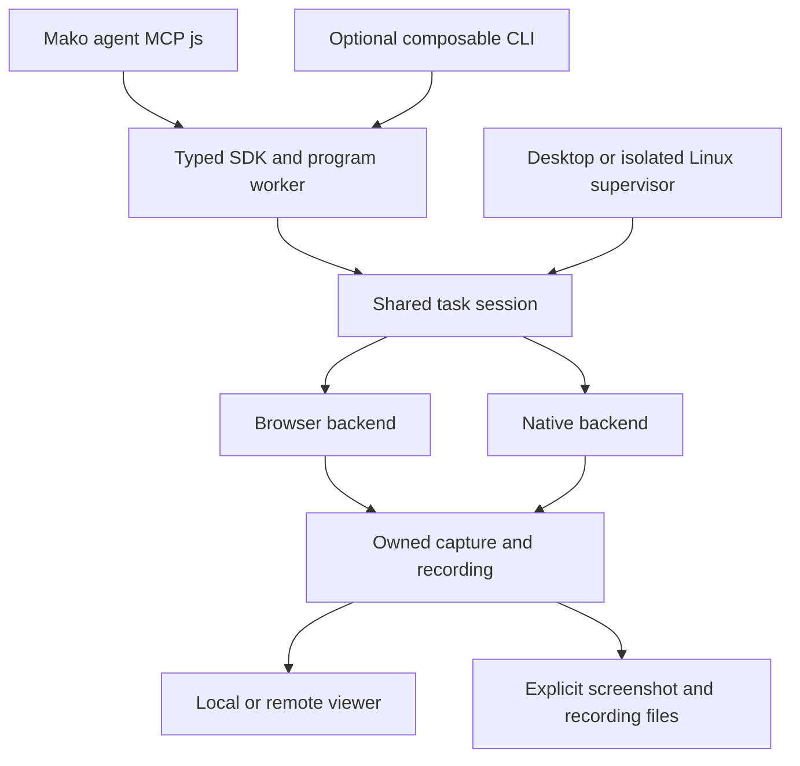

# Local Control architecture and change boundaries

Design requirements, revised 2026-09-24. The [wayfinder](local-control-map.md) owns progress.
The user wants one system that can evolve without fragile cross-component fixes:
local Mac, remote browsers and future isolated Linux jobs must reuse the browser/
computer engine, with low-latency media where useful. Human takeover is deferred.
The session extraction is implemented locally; release acceptance is tracked in Wayfinder.

## One engine, separate responsibilities

The viewer is an output consumer, not another automation engine. Media may use a
separate connection or worker so frame work cannot block commands. That separation
does not duplicate target ownership, authorization, retries or input semantics.
The main harness continues to choose actions. Cloud-specific optimizations stay
behind backend capabilities and the supervisor that actually owns the resources.

| Boundary | Owns | Must not leak into callers |
| --- | --- | --- |
| Public contract (`@mako/control`) | Typed targets, actions, observations, capabilities and outcomes; deliberate output and strict selection semantics. | OS handles, CDP sessions, codec negotiation, MCP cells in shell workflows, or backend-specific failure guessing. |
| Task session | Program lifetime/state, authoritative grants/leases, observation/ref validity, action ordering, uncertainty and cancellation. | Separate command/viewer ownership maps or target selection based on whichever process happens to answer. |
| Browser/native backend | Exact target attachment, backend input/capture mechanisms, supported capabilities and truthful results. | A false promise that every backend supports the same gestures, capture scope, background delivery or frame rate. |
| Capture and recording owner | Shared source lifetime, actual geometry/timestamps, bounded subscribers, interruption and artifact finalization. | Consumer-managed stream start/stop races, recording geometry inferred from viewport metadata, or preview quality silently defining saved evidence. |
| MCP/CLI/viewer adapters | Request validation/formatting, transport lifecycle and consumer subscriptions. | Another planner, automatic action replay, a second ref cache or private input shortcuts. |
| Process supervisor | Launch, readiness, resource limits, process groups, shutdown and artifact retention for resources it owns. | Assuming Electron, a user desktop or a cloud provider is always present; destroying a shared user browser as if it were an owned test process. |

These are ownership boundaries, not a requirement to create six new packages or
processes. Keep an existing implementation when its boundary already works. A new
abstraction must remove caller knowledge or isolate a demonstrated dependency;
a wrapper that only forwards methods does not earn another layer.

## Start with the actual seams

- [`createControlSession`](../packages/control-runtime/src/control-session.ts) owns program/session
  state and host policy. The task supervisor owns its desktop worker; the CLI
  socket adapter calls that exact session.
  Browser capture, native dispatch and recovery have no second CLI implementation.
- [`startControlService`](../electron/control-service.ts) is an existing authorized
  HTTP bridge for browser/preview work. It is not already the extracted cross-
  platform session engine. Preserve its binding-versus-conversation distinction;
  the prior preview owner bug is a regression case for this boundary.
- [`BrowserService`](../packages/control-runtime/src/browser-service.ts) and the
  [native driver connection](../packages/control-runtime/src/computer-driver-client.ts) are real
  backend seams. Reuse them; do not force both into a giant interface of optional
  methods. Backend-specific capability variants remain explicit and validated.
- [`BrowserCapture`](../packages/control-runtime/src/browser-capture.ts) already centralizes tab stream
  ownership. Extend the media seam behind it without making preview components
  start another CDP screencast. Native capture has different source/lifecycle
  behavior; share only the metadata, ownership and consumer contracts it can honor.
- The [cloud worker](../packages/control-runtime/src/cloud-control-worker.ts) and
  [launcher](../packages/control-runtime/src/cloud-control-main.ts) demonstrate a non-Electron owner.
  Keep the desktop and isolated-job lifecycle policies explicit. A broken viewer
  connection is not automatically a request to destroy its running job.

The [CLI contract](local-control-cli.md) defines consumer behavior. The
[streaming plan](local-control-streaming.md) defines media experiments. Neither
should introduce a duplicate engine to avoid doing the extraction above.

## Lifecycle and failure contracts

Each long-lived resource has one owner and one close path. Specify its states,
allowed transitions, cancellation during startup and repeated shutdown behavior
before replacing it. Test races at these transitions with deterministic fakes,
then exercise the actual backend. Do not create a single collection of optional
booleans that admits “stopped but still authorized and sending frames”.

Keep three kinds of state separate: task/target authorization, backend attachment,
and media delivery. An idle screen, a hidden viewer, a failed encoder and an ended
target are different events. Reconnecting media cannot repair an expired input
lease. An action failure reports not-dispatched/rejected/unknown consistently at
every adapter; a preview failure cannot rewrite that outcome or replay the action.
A successful dispatch still needs explicit state verification.

Use bounded queues and documented overload behavior. Preserve command ordering
for a target, let safe independent work proceed, and replace superseded preview
frames rather than accumulating latency. A recorder's storage limit must produce
an explicit artifact outcome, not silently redefine the preview's health.
Existing resources that belong to the user are borrowed; job-owned processes and
profiles can have stricter teardown. Encode that distinction in lifecycle inputs.

## Diagnose failures without changing the experiment

Add bounded, structured diagnostics as part of the shared engine, not per-adapter
print statements. Correlate a session, exact target generation, operation, media
subscription and artifact without logging bearer grants or credentials. Report
build/protocol/backend versions, stage, monotonic timing/clock domain, outcome,
refusal/interruption reason and relevant queue/frame counters.

A diagnostic should answer: did admission reject the command, did the backend
receive it, did the target change, did capture produce pixels, did encoding or
transport drop work, and did the viewer present it? These are distinct claims.
For unknown input outcomes, absence of a receipt is not proof of non-delivery.

Default diagnostics should be cheap metadata. Do not capture screenshots, record
keystroke contents, dump page text or start video to explain an ordinary text read.
Rich trace/media collection needs an explicit bounded diagnostic mode. Make the
result exportable as files with a schema/version and clear missing-evidence fields;
a support bundle must exclude secrets and unrelated task content. The planned
CLI should expose status/diagnostics through this same read-only engine boundary.
Diagnostics must have an instrumentation-overhead check of their own.

## Prove that the design is easier to change

| Change exercise | Acceptance criterion |
| --- | --- |
| Add or change an agent/CLI adapter | Same session engine and backend jobs; adapter-specific code covers parsing, output, exit codes and connection lifetime. No duplicated action policy or targets. |
| Swap JPEG delivery for a measured media candidate | Input/observation contracts and artifact fidelity are unchanged; only media adapter/capability and viewer integration change. Existing streams retain scoped cleanup. |
| Add a Linux capture/compositor route | Backend implementation, capability registration and conformance fixtures change. Harness/CLI command handlers need no per-compositor branches. |
| Inject a detach after input dispatch | Every adapter reports unknown outcome, prevents unsafe continuation and requires fresh evidence. A fresh unrelated target still works. |
| Add a second viewer during recording | Existing target/source ownership is reused; CPU/encode counts are measurable; closing one consumer cannot terminate the others. |
| Reproduce a reported bug | A small synthetic fixture plus bounded correlated diagnostics identifies the failing stage without a model run, arbitrary sleeps or the user's live data. |

Run conformance cases through the same boundaries callers use. Fakes can substitute
clock, transport, driver or encoder at those boundaries; they must not bypass
validation to make a test easy. Keep real fixtures for input retention, compositor
behavior and packaging facts that fakes cannot prove. Preserve exact decoded pixels,
independent saved state and no-replay checks while optimizing.

## Refactor sequence and deletion gate

1. Retain observed failure cases and write down the current ownership/lifetime
   contract. Establish the diagnostic fields needed to compare implementations.
2. Extract the task-session owner from MCP registration without changing callers'
   behavior. Test it with injected backend/transport faults and shutdown races.
3. Keep session startup in task supervisors. Mako agents use persistent-JS MCP
   over the typed engine; the optional CLI borrows the same session. Retire the
   former status/help/exec tools. Verify discovery, cancellation, truthful
   capabilities and consistent outcomes. This supersedes the CLI-only decision.
4. Add the measured media transport/capture changes behind that owner. Keep local,
   remote-browser and isolated-Linux composition explicit at startup.
5. Remove superseded paths, duplicated caches, timers, compatibility branches and
   compiled outputs after migrating actual callers. Check package contents and
   cold starts; a renamed old implementation is not removal.

Do not build a universal plugin framework, rewrite native capture in another
language, or promise full human-control UI as a prerequisite. Judge the refactor
by fewer facts each caller must know, localized changes, reproducible failures and
unchanged accuracy—not the number of interfaces, files or services it creates.
