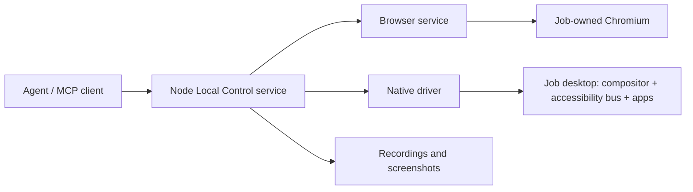

# Local Control on desktop and cloud

Local Control does not require Electron. The native x64 acceptance run on EC2
used a Node MCP process, the native driver and a private Linux desktop. Its
runtime dependency manifest contains no Electron or provider runtime. Browser
control is also a Node service; Electron is an adapter for controlling Mako’s
own hidden windows, not a dependency of the browser service.

The full Mako application host currently still runs in Electron, including
`electron/start.mjs --web`. That flag removes its visible desktop window; it
does not turn the entire workspace/provider host into a standalone Node app.
The Local Control files living under `electron/` does not mean they import the
Electron runtime. Do not package the whole Mako app merely to run these files.

## Current boundaries

| Component | Owner and dependencies | Evidence / remaining work |
| --- | --- | --- |
| Public API and program worker | `packages/control`; Node and Zod | Shared across providers; no Electron import. |
| MCP adapter and native policy | `electron/computer-tools-main.ts`; Node and MCP SDK | Executed on native Intel EC2 without Electron. |
| Browser transport, targets and recording | `electron/browser-service.ts`; Node, ws, image decoding and FFmpeg when recording | Can be composed directly with the MCP adapter using `browserCall`; this turn’s dev capture used that composition under Node. |
| Native driver | Patched Cua executable | Separate process. macOS uses the desktop host’s responsibility/permission chain; Linux uses the job’s display and accessibility bus. |
| Hidden Mako desk | Electron `BrowserWindow` adapter | Only needed to inspect Mako itself. Dev screenshot and recording pass after renderer readiness. |
| Cloud launcher and release | Not yet a finished standalone product | Acceptance scripts provide test startup/teardown, not a released general-purpose supervisor. |

The screenshot test initially captured an empty page during renderer startup.
A valid PNG or successful transport call does not establish application readiness.
The passing capture waited for accessible UI and was visually inspected. A
hidden desk is another client of that host, not an exact clone of the user’s
current browser tab or unsent draft.

## Cloud composition

A trusted job runner should start one control runtime inside each disposable VM
or container boundary. Agents use the same three MCP tools and bound handles.
They do not manage displays, driver processes or credentials themselves.

Browser-only jobs need Chromium, the browser service and optional recording
media tools. Native jobs additionally need an X11 or supported Wayland desktop,
D-Bus/AT-SPI, the driver and their target applications. Electron is needed only
if a target application itself uses Electron. Separate jobs must not share a
native desktop merely because their API sessions have different IDs.

Keep two browser environments explicit:

- On a person’s machine, use the installed extension and chosen regular profile.
  Do not silently switch to remote debugging or another browser.
- In a cloud job, the trusted launcher owns Chromium and a temporary profile.
  An explicit private CDP endpoint is appropriate there. It must stay within the
  job boundary and never become a publicly reachable debugging port. Extension
  consent for someone’s existing profile is a different deployment case.

Direct CDP therefore remains useful. Removing it would break owned cloud
browsers and Mako desk inspection without improving the regular-profile route.

## Lifecycle required for a cloud release

Reuse the existing service and policy implementations, with a small platform
launcher. Do not create another agent-facing API or copy browser/native logic.
The desktop app owns that launcher locally; a cloud job supervisor owns it in
the cloud. A permanent machine-wide daemon shared by unrelated tenants is not
the default.

The launcher must:

1. Create private per-job directories, sockets, display/bus and browser profile.
   Accept only the capabilities and credentials provided by the trusted runner.
   Do not copy a developer’s home, sessions, browser profile or cloud CLI files.
2. Start only requested backends and wait for actual readiness. Keep the native
   daemon, browser connection and observation caches alive across calls, rather
   than restarting them for every screenshot or keystroke.
3. On EOF, cancellation or a deadline, stop admitting actions, cancel waits,
   release held input and begin bounded recording finalization. Close owned
   pages/processes and remove only this job’s resources. The VM/container TTL is
   the backstop if the service crashes before its cleanup finishes.
4. On a driver/browser crash, preserve interruption evidence and partial media.
   A new backend generation invalidates old handles. Reconnection never replays
   input whose result is uncertain.
5. Leave result files for the runner to collect, then remove the sandbox. Limit
   artifact duration, dimensions and storage; do not stream unrequested images.

Required release acceptance includes browser-only and native-only startup with
no Electron executable installed, mixed complete jobs, concurrent isolated jobs,
EOF/SIGTERM/deadline cleanup, child crashes, cancellation during held input,
recording finalization and stale-handle refusal after restart. The current EC2
suite proves native functional execution and test-container cleanup, not all of
these production lifecycle cases.

## Reference comparison

The supplied `codex-cu-reference-evidence.md` reports a local native service and
a Linux wrapper that reuses a child process, closes it on parent exit and starts
a fresh one after a restart response. That supports the service architecture;
it does not establish OpenAI’s exact cloud isolation or explain the authors’
intent. Their Linux executable remains unavailable for direct comparison.

See [disposable-machine acceptance](local-control-ci.md) for contributor CI and
[packaging](local-control-packaging.md) for target-specific artifact status.
